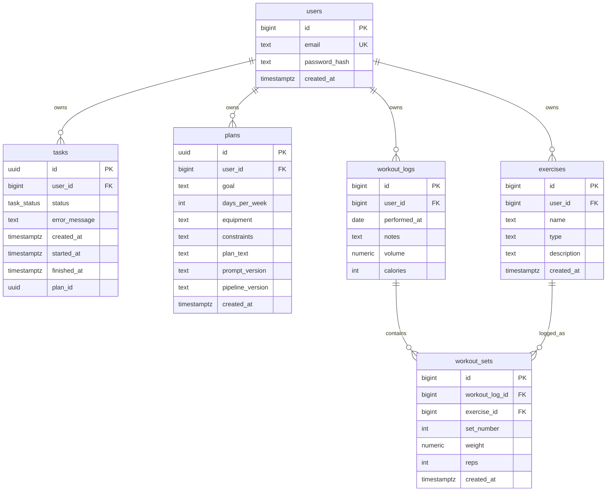

# Database

ChangeNow uses PostgreSQL 16. The schema is defined by SQL files in `services/api-go/migrations/` and applied at API startup by `services/api-go/internal/db/migrate.go`.

## Entity Relationship Diagram

## Migration Runner

The Go API calls `db.Run(context.Background(), pool)` during startup. The runner:

- Creates `schema_migrations` if missing.
- Takes a PostgreSQL advisory lock before applying migrations.
- Reads embedded SQL files from `services/api-go/migrations`.
- Applies files in lexical order.
- Records each applied filename.
- Expects migrations to be idempotent.

The Docker Compose database also mounts migrations into `/docker-entrypoint-initdb.d` for fresh volumes. The embedded runner is the authoritative path for existing databases.

## Tables

### `users`

Purpose: account identity for authenticated app users.

| Column | Type | Constraints | Notes |
| --- | --- | --- | --- |
| `id` | `bigserial` | primary key | Internal user ID used in JWT claims. |
| `email` | `text` | unique, not null | Registration identity. |
| `password_hash` | `text` | not null | bcrypt hash. |
| `created_at` | `timestamptz` | not null, default `now()` | Account creation time. |

### `tasks`

Purpose: async plan-generation status tracking.

| Column | Type | Constraints | Notes |
| --- | --- | --- | --- |
| `id` | `uuid` | primary key | Generated by API when enqueueing work. |
| `user_id` | `bigint` | not null, FK `users(id)` on delete cascade | Owner. |
| `status` | `task_status` | not null, default `pending` | `pending`, `running`, `done`, or `failed`. |
| `error_message` | `text` | nullable | Worker error details. |
| `created_at` | `timestamptz` | not null, default `now()` | Task creation time. |
| `started_at` | `timestamptz` | nullable | Set when worker starts. |
| `finished_at` | `timestamptz` | nullable | Set on success or failure. |
| `plan_id` | `uuid` | nullable | Completed plan ID. No FK is currently declared. |

### `plans`

Purpose: persisted AI-generated workout plans.

| Column | Type | Constraints | Notes |
| --- | --- | --- | --- |
| `id` | `uuid` | primary key | Generated by worker. |
| `user_id` | `bigint` | not null, FK `users(id)` on delete cascade | Owner. |
| `goal` | `text` | nullable | User request input. |
| `days_per_week` | `int` | nullable | User request input. |
| `equipment` | `text` | nullable | User request input. |
| `constraints` | `text` | nullable | User request input. |
| `plan_text` | `text` | not null | AI output, normally JSON text. |
| `prompt_version` | `text` | not null, default `v1` | Prompt template version. |
| `pipeline_version` | `text` | not null, default `v1` | Currently stored as `provider/model` by the worker. |
| `created_at` | `timestamptz` | not null, default `now()` | Plan creation time. |

### `exercises`

Purpose: user-owned exercise library.

| Column | Type | Constraints | Notes |
| --- | --- | --- | --- |
| `id` | `bigserial` | primary key | Exercise ID. |
| `user_id` | `bigint` | not null, FK `users(id)` on delete cascade | Owner. |
| `name` | `text` | not null | Exercise display name. |
| `type` | `text` | not null, default `Strength training` | Category. |
| `description` | `text` | not null, default empty string | Optional details. |
| `created_at` | `timestamptz` | not null, default `now()` | Creation time. |

Constraint: `UNIQUE(user_id, name)` prevents duplicate exercise names per user.

### `workout_logs`

Purpose: daily workout summary per user.

| Column | Type | Constraints | Notes |
| --- | --- | --- | --- |
| `id` | `bigserial` | primary key | Workout log ID. |
| `user_id` | `bigint` | not null, FK `users(id)` on delete cascade | Owner. |
| `performed_at` | `date` | not null, default `CURRENT_DATE` | Training date. |
| `notes` | `text` | not null, default empty string | Daily notes. |
| `volume` | `numeric(10,2)` | not null, default `0.00` | Sum of `weight * reps` for logged sets. |
| `calories` | `int` | not null, default `0` | Present in schema; no calculation is implemented. |

Constraint: `workout_logs_user_day_unique UNIQUE(user_id, performed_at)` enforces one daily log per user.

### `workout_sets`

Purpose: detailed set-level workout data.

| Column | Type | Constraints | Notes |
| --- | --- | --- | --- |
| `id` | `bigserial` | primary key | Set ID. |
| `workout_log_id` | `bigint` | not null, FK `workout_logs(id)` on delete cascade | Owning daily log. |
| `exercise_id` | `bigint` | not null, FK `exercises(id)` on delete cascade | Exercise performed. |
| `set_number` | `int` | not null | Assigned by server per workout log and exercise. |
| `weight` | `numeric(7,2)` | not null | Weight used. |
| `reps` | `int` | not null | Repetitions. |
| `created_at` | `timestamptz` | not null, default `now()` | Set creation time. |

### `schema_migrations`

Purpose: records migration files applied by the embedded Go runner.

| Column | Type | Constraints | Notes |
| --- | --- | --- | --- |
| `filename` | `text` | primary key | SQL filename. |
| `applied_at` | `timestamptz` | not null, default `now()` | Application time. |

## Migration Log

### `001_init.sql`

- Creates `users`.
- Creates enum `task_status` if missing.
- Creates `tasks`.
- Creates `plans`.

### `002_exercises_and_workouts.sql`

- Creates `exercises`.
- Creates `workout_logs`.
- Creates `workout_sets`.
- Adds per-user exercise-name uniqueness.

### `003_workout_logs_unique_day.sql`

- Deduplicates existing duplicate workout logs by `(user_id, performed_at)`.
- Reparents duplicate rows' `workout_sets` to the canonical log.
- Merges volume, calories, and notes.
- Adds `workout_logs_user_day_unique`.

### `004_workout_logs_volume_widen.sql`

- Widens `workout_logs.volume` to `numeric(10,2)` to prevent daily volume overflow.

## Conventions

- User-facing business rows use `bigserial` IDs except async `tasks` and `plans`, which use UUIDs.
- Timestamps use `timestamptz`; workout day identity uses `date`.
- Cascading deletes are used from `users` to owned data and from logs/exercises to sets.
- Soft deletes are not implemented.
- Plan output is stored as text, not JSONB.
- No explicit secondary indexes are currently declared beyond primary keys and unique constraints.

