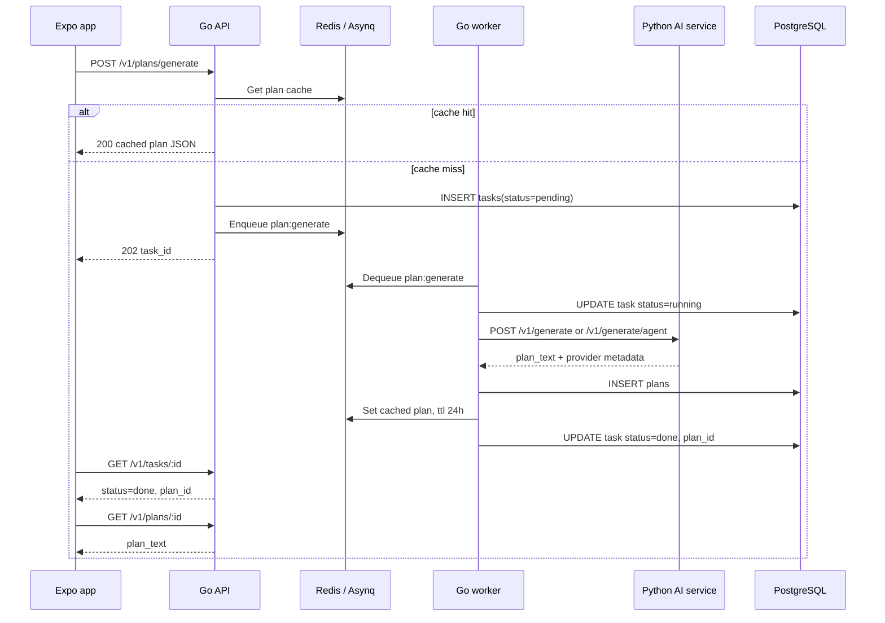

# Async Plan-Generation Flow

Plan generation is asynchronous because LLM calls can be slow. The Go API returns a task ID quickly, while the Go worker performs the expensive work in the background.

## Sequence



## Task States

| State | Writer | Meaning |
| --- | --- | --- |
| `pending` | API | Task row created and queued. |
| `running` | Worker | Worker has started processing. |
| `done` | Worker | Plan was persisted and task has `plan_id`. |
| `failed` | Worker | AI call failed; `error_message` is set. |

## Cache Behavior

The cache key is generated from:

- user ID
- goal
- days per week
- equipment
- constraints
- prompt version
- `use_agent`

The `use_agent` flag is included because the plain generator and agent workflow can produce different artifacts for the same visible inputs.

Cache hits return a JSON body with:

```json
{
  "id": "plan-uuid",
  "plan_text": "..."
}
```

Cache misses enqueue a task and return:

```json
{
  "task_id": "task-uuid",
  "status": "pending",
  "message": "Plan generation started. Poll GET /v1/tasks/:id for status."
}
```

## Failure Modes

- Redis unavailable in API: rate limiting and cache are disabled, but Asynq still requires a valid `REDIS_URL` client setup.
- Queue enqueue failure: API returns `500 failed to enqueue task` after inserting the task row.
- AI service failure: worker marks the task `failed`, stores `error_message`, and returns an error to Asynq for retry.
- Plan insert failure: worker returns an error; Asynq retries.
- Cache write failure after plan insert: worker logs a warning and still marks the task done.

## Timeouts And Retries

- Go AI client timeout: 120 seconds.
- Asynq task timeout: 120 seconds.
- Asynq max retry: 3.
- Worker concurrency: 5.

