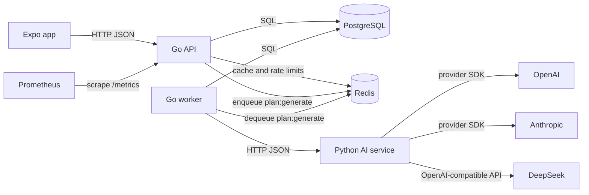

# Architecture Overview

ChangeNow is split into three application surfaces:

- Expo React Native frontend in `frontend/`.
- Go REST API and worker in `services/api-go/`.
- Python FastAPI AI service in `services/ai-py/`.

PostgreSQL stores durable data. Redis supports plan caching, rate limiting, and Asynq queueing. Prometheus scrapes Go API metrics.

## System Diagram

## Responsibilities

### Frontend

The Expo app owns screens, navigation, token storage, input validation, and rendering plan/workout history. API calls live under `frontend/lib/`.

Key flows:

- Auth: `frontend/lib/auth.tsx` and `frontend/lib/api.ts`.
- Plan generation: `frontend/lib/plans.ts`.
- Exercise and workout data: `frontend/lib/exercises.ts`.

### Go API

The Go service owns public REST contracts, authentication, database writes, task creation, Redis cache/rate-limit behavior, metrics, and graceful shutdown.

Entry points:

- API binary: `services/api-go/cmd/api/main.go`.
- Worker binary: `services/api-go/cmd/worker/main.go`.
- Routes: `services/api-go/internal/http/routes.go`.
- Handlers: `services/api-go/internal/http/handlers/`.

### Go Worker

The worker consumes Asynq `plan:generate` jobs. It updates task status, calls the Python AI service, persists `plans`, warms Redis plan cache, and records LLM metrics.

### Python AI Service

The Python service owns prompt rendering, LLM provider fallback, and optional agent workflow orchestration.

Main components:

- FastAPI endpoints: `services/ai-py/app/main.py`.
- LLM gateway: `services/ai-py/app/llm/gateway.py`.
- Providers: `services/ai-py/app/llm/providers/`.
- Prompt manager: `services/ai-py/app/prompts/manager.py`.
- LangGraph workflow: `services/ai-py/app/agent/`.

## Request Boundaries

The frontend only calls the Go API. The Go worker is the only Go component that calls the Python AI service for plan generation. The Python service does not write to the database.

## Data Ownership

- PostgreSQL is the source of truth for users, tasks, plans, exercises, workout logs, and workout sets.
- Redis plan cache is derived data with a 24 hour TTL.
- Redis rate-limit keys are transient.
- Asynq task payloads are transient queue state; task status is also written to PostgreSQL.

## Current Gaps

- The Go API does not currently expose `/v1/health`; only `/metrics` is registered outside `/v1`.
- `tasks.plan_id` is not declared as a foreign key to `plans(id)`.
- `plans.plan_text` stores JSON as text; schema-level JSON validation is not enforced.
- Python LLM fallback events are logged but the Go `llm_fallback_total` metric is not incremented by the Python service.

